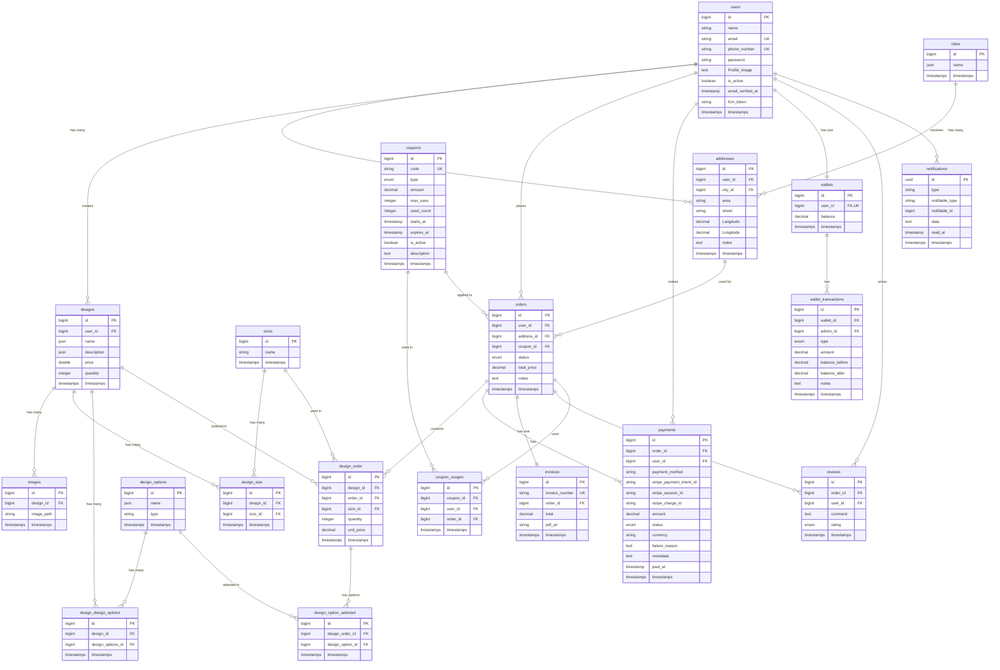

# Database ERD - Kandura E-Commerce

## Entity Relationship Diagram



---

## الجداول | Tables Summary

### جداول المستخدمين | User Tables

| الجدول | الوصف |
|--------|-------|
| `users` | المستخدمين (عملاء + أدمن) |
| `addresses` | عناوين المستخدمين |
| `cities` | المدن |
| `wallets` | محافظ المستخدمين |
| `wallet_transactions` | معاملات المحفظة (إيداع/سحب) |

### جداول التصاميم | Design Tables

| الجدول | الوصف |
|--------|-------|
| `designs` | التصاميم المخصصة |
| `images` | صور التصاميم |
| `sizes` | المقاسات المتاحة |
| `design_size` | علاقة M:N بين التصاميم والمقاسات |
| `design_options` | خيارات التصميم (لون، نوع قماش، الخ) |
| `design_design_options` | علاقة M:N بين التصاميم وخياراتها |

### جداول الطلبات | Order Tables

| الجدول | الوصف |
|--------|-------|
| `orders` | الطلبات الرئيسية |
| `design_order` | تفاصيل الطلب (التصاميم المطلوبة) |
| `design_option_selected` | الخيارات المختارة لكل تصميم في الطلب |
| `payments` | معاملات الدفع (Stripe) |
| `invoices` | الفواتير |
| `reviews` | تقييمات الطلبات |

### جداول الكوبونات | Coupon Tables

| الجدول | الوصف |
|--------|-------|
| `coupons` | كوبونات الخصم |
| `coupon_usages` | سجل استخدام الكوبونات |

### جداول النظام | System Tables

| الجدول | الوصف |
|--------|-------|
| `notifications` | إشعارات المستخدمين |
| `sessions` | جلسات تسجيل الدخول |
| `jobs` | Queue jobs |
| `cache` | Cache storage |

---

## العلاقات الرئيسية | Key Relationships

### design_option_selected

هذا الجدول يربط بين:
- `design_order` (التصميم المطلوب في الطلب)
- `design_options` (الخيار المحدد مثل اللون أو نوع القماش)

```
Order → design_order → design_option_selected ← design_options
        (التصميم+المقاس)     (الخيارات المختارة)    (خيارات التصميم)
```

**مثال:**
- طلب #5 يحتوي Design #3 بمقاس Large
- العميل اختار: لون أبيض + قماش قطني + تطريز ذهبي
- كل خيار يُحفظ في `design_option_selected`

---

## Migration Files

| الملف | الجدول |
|-------|--------|
| `0001_01_01_000000_create_users_table.php` | users, sessions |
| `2025_11_19_190915_create_cities_table.php` | cities |
| `2025_11_19_200052_create_addresses_table.php` | addresses |
| `2025_11_28_180257_create_designs_table.php` | designs |
| `2025_11_28_181418_create_design_options_table.php` | design_options |
| `2025_11_28_181607_create_design_design_options_table.php` | design_design_options |
| `2025_11_28_182107_create_images_table.php` | images |
| `2025_11_29_121101_create_sizes_table.php` | sizes |
| `2025_11_29_121149_create_design_size_table.php` | design_size |
| `2025_12_11_114424_create_orders_table.php` | orders |
| `2025_12_11_115637_create_design_order_table.php` | design_order |
| `2025_12_11_115807_create_design_option_selected_table.php` | design_option_selected |
| `2025_12_23_150047_create_wallets_table.php` | wallets, wallet_transactions |
| `2026_01_19_192033_create_payments_table.php` | payments |
| `2026_01_25_042532_create_coupons_table.php` | coupons |
| `2026_01_25_042757_create_coupon_usages_table.php` | coupon_usages |
| `2026_01_26_212751_create_invoices_table.php` | invoices |
| `2026_01_27_094734_create_reviews_table.php` | reviews |
| `2026_01_28_204724_create_notification_table.php` | notifications |
| `2026_02_04_000001_add_fcm_token_to_users_table.php` | (adds fcm_token to users) |
